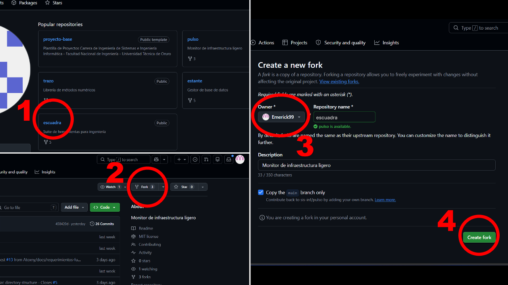
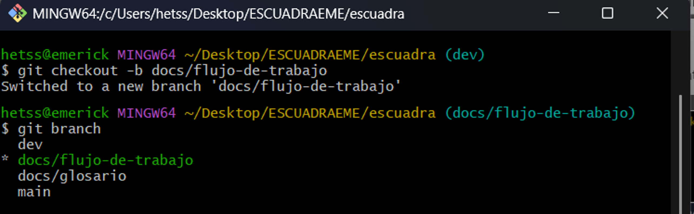
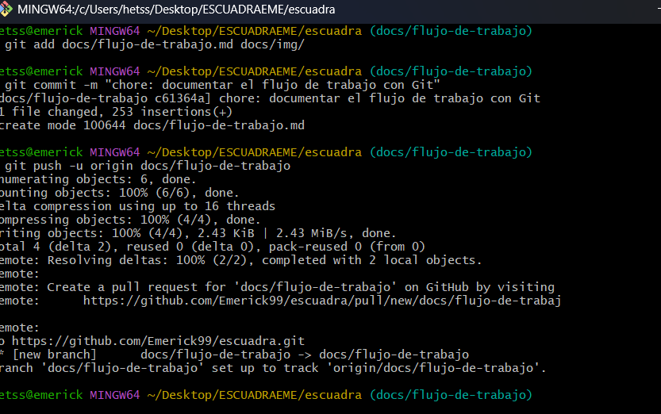
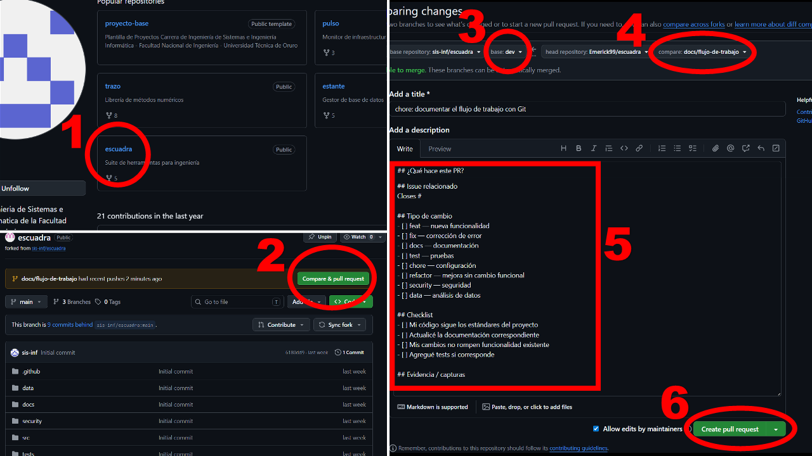

# Flujo de trabajo con Git: Forking Workflow para Escuadra

## Introducción

El **Forking Workflow** es una forma de trabajo colaborativo en GitHub donde cada integrante realiza una copia del repositorio principal, llamada **fork**.  
Desde ese fork, cada persona puede trabajar en una rama propia, hacer cambios, subirlos a GitHub y proponerlos al proyecto principal mediante un **Pull Request**.

Este flujo ayuda a mantener ordenado el trabajo del equipo y evita modificar directamente las ramas principales del repositorio original.

---

## 1. Hacer fork del repositorio

El primer paso es crear una copia del repositorio principal en nuestra cuenta de GitHub.

### Pasos

1. Ingresar al repositorio principal del proyecto.
2. Hacer clic en el botón **Fork**.
3. Seleccionar nuestra cuenta como destino.
4. Hacer clic en **Create fork**.

Después de este paso, GitHub creará una copia del repositorio en nuestra cuenta personal.



**Figura 1.** Creación del fork del repositorio principal.

---

## 2. Clonar el fork en la computadora

Una vez creado el fork, se debe clonar el repositorio en la computadora.

```bash
git clone https://github.com/TU-USUARIO/NOMBRE-DEL-REPOSITORIO.git
```

Luego se ingresa a la carpeta del proyecto:

```bash
cd NOMBRE-DEL-REPOSITORIO
```

También se recomienda agregar el repositorio original como remoto `upstream`:

```bash
git remote add upstream https://github.com/ORGANIZACION/NOMBRE-DEL-REPOSITORIO.git
```

---

## 3. Sincronizar el proyecto con la rama `dev`

Antes de crear una nueva rama, es importante actualizar el proyecto con los últimos cambios del repositorio original.

```bash
git checkout dev
git pull upstream dev
```

Esto permite trabajar sobre una base actualizada y evita conflictos innecesarios.

---

## 4. Crear una rama de trabajo

La rama se crea con el siguiente comando:

```bash
git checkout -b docs/flujo-de-trabajo
```

Para verificar que estamos en la rama correcta:

```bash
git branch
```

Debe aparecer marcada con un asterisco:

```bash
* docs/flujo-de-trabajo
```



**Figura 2.** Creación y verificación de la rama `docs/flujo-de-trabajo`.

---

## 5. Crear o modificar archivos

En este caso, se debe crear el archivo:

```text
docs/flujo-de-trabajo.md
```

## 6. Hacer commit de los cambios

Primero se agregan los archivos modificados:

```bash
git add docs/flujo-de-trabajo.md docs/img/
```

Luego se realiza el commit:

```bash
git commit -m "chore: documentar el flujo de trabajo con Git"
```

El commit guarda los cambios de forma local con un mensaje que describe lo realizado.

---

## 7. Hacer push de la rama

Después de hacer el commit, se debe subir la rama al repositorio remoto.

```bash
git push -u origin docs/flujo-de-trabajo
```

El comando `push` envía los cambios desde la computadora hacia GitHub.



**Figura 3.** Commit de los cambios y subida de la rama a GitHub.

---

## 8. Abrir un Pull Request

Cuando la rama ya está subida a GitHub, se debe abrir un **Pull Request** para proponer los cambios al repositorio principal.

### Pasos

1. Entrar al repositorio en GitHub.
2. Hacer clic en **Compare & pull request**.
3. Verificar que la rama destino sea `dev`.
4. Verificar que la rama de origen sea:

```text
docs/flujo-de-trabajo
```

5. Completar la descripción del Pull Request.
6. Hacer clic en **Create pull request**.



**Figura 4.** Creación del Pull Request desde la rama `docs/flujo-de-trabajo`.

---

## 9. Errores comunes y cómo resolverlos

### Error 1: Trabajar directamente en la rama `dev` o `main`

Uno de los errores más comunes es hacer cambios directamente en una rama principal, como `dev` o `main`.

Para verificar la rama actual:

```bash
git branch
```

Si estás en `dev` o `main`, crea una rama nueva antes de continuar:

```bash
git checkout -b docs/flujo-de-trabajo
```

De esta manera, los cambios quedan separados y se evita modificar directamente una rama principal.

---

### Error 2: Olvidar hacer `git add` antes del commit

A veces se intenta hacer commit, pero Git indica que no hay cambios agregados.

Ejemplo del problema:

```bash
nothing added to commit
```

Solución:

```bash
git status
git add docs/flujo-de-trabajo.md docs/img/
git commit -m "chore: documentar el flujo de trabajo con Git"
```

El comando `git add` prepara los archivos para que puedan ser incluidos en el commit.

---

### Error 3: El push falla porque la rama no existe en GitHub

Cuando se sube una rama nueva por primera vez, puede ser necesario usar `-u`.

Solución:

```bash
git push -u origin docs/flujo-de-trabajo
```

La opción `-u` conecta la rama local con la rama remota, haciendo más fácil usar `git push` en el futuro.

---

### Error 4: El fork está desactualizado

Si el repositorio principal tuvo cambios nuevos, el fork puede quedar desactualizado.

Solución:

```bash
git checkout dev
git pull upstream dev
```

Luego se puede crear una nueva rama actualizada:

```bash
git checkout -b docs/flujo-de-trabajo
```

Esto ayuda a evitar conflictos al momento de abrir el Pull Request.

---

## 10. Recomendaciones finales

- Crear una rama nueva para cada issue.
- Usar nombres de ramas claros y relacionados con la tarea.
- Revisar los cambios con `git status` antes de hacer commit.
- Escribir mensajes de commit descriptivos.
- Subir la rama al fork usando `git push`.
- Abrir un Pull Request para que el equipo revise los cambios.
- No trabajar directamente sobre `dev` o `main`.

---

## Conclusión

El Forking Workflow permite colaborar de manera ordenada en Escuadra.  
Cada integrante trabaja desde su propio fork, crea una rama para cada tarea, realiza sus cambios, los sube a GitHub y finalmente abre un Pull Request para que el equipo pueda revisarlos antes de integrarlos al proyecto principal.